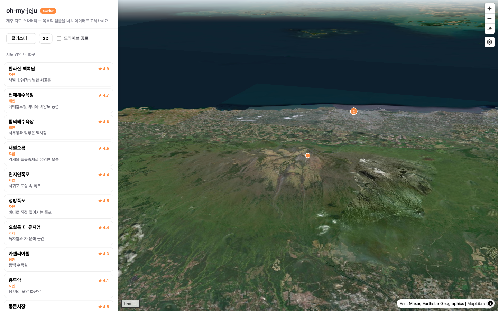

# oh-my-jeju

[](LICENSE)


**제주도 해커톤 스타터팩** — 받자마자 제주 3D 지도 위에서 아이디어를 시작할 수 있는 템플릿입니다.



지도 엔진, 고품질 제주 지형, 지도 서비스의 공통 기능(클러스터·히트맵·팝업·경로·현재위치·
리스트 연동 셸)이 미리 만들어져 있습니다. **데이터는 직접 가져옵니다(BYOD)** — 어떤 GeoJSON이든
꽂으면 바로 시각화됩니다. 데이터 출처·변환법은 [docs/data-sources.md](docs/data-sources.md)를 참고하세요.

## 시작 (3분)

```bash
# 이 레포를 템플릿으로 사용 (GitHub: Use this template / 로컬: degit)
pnpm install
pnpm dev          # → http://localhost:5173
```

실행하면 한라산 3D 지형, 샘플 관광지 15곳(클러스터), 사이드 리스트 ↔ 지도 연동이 보입니다.
`apps/starter/src/sample-data.ts`의 안내를 따라 샘플을 직접 준비한 데이터로 교체하면 됩니다.

## 받으면 들어있는 것

| 기능 | 사용법 |
|---|---|
| 제주 2D/3D 지도 (지형 내장, 타일 서버 불필요) | `<JejuMapView mode="3d" terrainUrl="/tiles/jeju-terrain.pmtiles">` |
| 데이터 소켓 — GeoJSON을 꽂으면 시각화 | `<JejuDataLayer data={...} type="cluster\|heatmap\|choropleth\|...">` |
| JSX 팝업·클릭·자동 스타일·범위 맞춤 | `popup={f => <Card .../>}` `onClick` `fitBounds` |
| 실시간 데이터 갱신 | `jeju.addDataLayer(...).setData(newData)` |
| 마커 | `<JejuMarker lng lat>JSX 팝업</JejuMarker>` |
| 경로 + 이동 애니메이션 | `<JejuRoute coordinates={[...]} animate />` |
| 현재 위치 (따라가기) | `<JejuMapView geolocate>` |
| 랜드마크 카메라 프리셋 7곳 | `jeju.flyTo('seongsan')` |
| 베이스맵 프리셋 | `basemap="satellite\|osm\|vworld-*"` ([VWorld 키](https://www.vworld.kr) 필요 시) |
| 앱 셸 (리스트↔지도 동기화, 모바일 바텀시트) | `apps/starter` 그 자체 |

표의 `terrainUrl`은 루트 배포 기준 예시입니다 — 서브패스 배포는 아래 [배포](#배포)를 참고하세요.

React가 아니어도 됩니다 — `@oh-my-jeju/map-core`는 프레임워크에 무관하며,
`jeju.map`으로 원본 maplibregl.Map에 항상 접근할 수 있습니다.

## 구조

```
apps/starter/      # ★ 직접 고쳐나갈 앱 (셸 + 샘플 데이터)
packages/
  map-core/        # 지도 코어 (vanilla TS)
  map-react/       # React 래퍼
docs/
  data-sources.md  # 제주 데이터 출처 + 좌표계/인코딩 변환 치트시트
  recipes/         # CSV 5분 코스, PostGIS 연동
poc/terrain/       # 지형 타일 생산 파이프라인 (DEM → PMTiles)
```

## 데이터 꽂기 (요약)

```tsx
<JejuDataLayer
  data="/my-data.geojson"        // URL 또는 FeatureCollection 객체
  type="cluster"                 // 시각화 프리셋 한 단어로 전환
  color="#ff8a3d"
  popup={(f) => <strong>{f.properties.name}</strong>}
  fitBounds
/>
```

CSV/SHP라면 [docs/recipes/byod-quickstart.md](docs/recipes/byod-quickstart.md) (5분),
공간 질의가 필요하면 [docs/recipes/postgis.md](docs/recipes/postgis.md)를 참고하세요.

## 지형 품질 더 올리기 (선택)

내장 지형은 Copernicus 30m DEM 기반입니다. 국토지리정보원 5m DEM으로 교체하면 더 정밀해집니다 —
[poc/terrain/README.md](poc/terrain/README.md)의 파이프라인에 입력만 바꾸면 됩니다.

## 배포

```bash
pnpm build          # apps/starter/dist 정적 빌드 (= pnpm --filter starter build)
```

> `pnpm build`는 앱만 빌드합니다 — 스타터는 워크스페이스 패키지를 src로 번들하므로 패키지 사전
> 빌드가 필요 없습니다. 패키지를 npm에 발행할 때만 `pnpm build:packages`를 쓰세요.

- **루트 호스팅**(Cloudflare/Netlify, `user.github.io` 직속): 그대로 올리면 됩니다.
- **GitHub Pages 프로젝트 사이트**(`user.github.io/<repo>/`처럼 서브패스): base를 맞춰야 에셋·지형
  타일이 404나지 않습니다.
  ```bash
  GITHUB_PAGES=1 pnpm build   # vite.config.ts의 base='/oh-my-jeju/' 적용
  ```
  레포 이름이 다르면 `vite.config.ts`의 base 값을 바꾸세요. 지형 경로는 `import.meta.env.BASE_URL`
  기준이라 base만 맞추면 자동으로 따라갑니다.
- **베이스맵**: 키리스 `satellite`(Esri)는 프로토타입용입니다 — 공개 배포 앱은 `osm` 또는 `vworld-*`를
  권장합니다. VWorld 키는 발급 시 등록한 **도메인에서만** 동작하므로 배포 도메인을 vworld.kr에
  등록해야 합니다(미등록 시 403). ⚠️ `vworldKey`는 브라우저 타일 URL에 그대로 실려 **공개**됩니다 —
  비밀이 아니라 도메인으로 제한되는 토큰으로 취급하고, 고권한·유료 키를 재사용하지 마세요.
- **글리프(라벨 폰트)**: 기본값은 MapLibre 데모 서버(`demotiles.maplibre.org`, SLA 없음)입니다.
  클러스터 개수 라벨 등 텍스트가 여기에 의존하므로, 공개 배포 앱은 글리프를 self-host하고
  `<JejuMapView glyphs="...">`로 교체하는 것을 권장합니다(오프라인·차단 환경의 라벨 누락 방지).

## 로드맵

- [x] v1 — 지도 모듈 + 데이터 소켓 + 경로/현재위치 + 앱 셸 + BYOD 문서
- [ ] v1.1 — 검색(지오코딩) 어댑터, 영역 선택 도구, 벡터 PMTiles 레이어 프리셋
- [ ] 트랙 B — 프리베이크 3D 메시 비주얼 쇼케이스 모듈 (Three.js)
